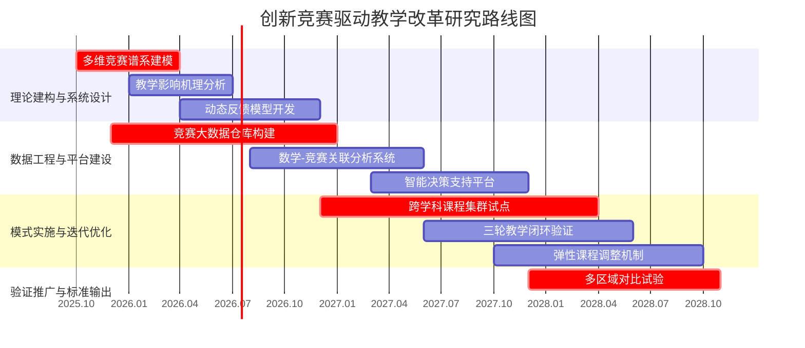

```mermaid
gantt
    title 创新竞赛驱动教学改革研究路线图
    dateFormat  YYYY-MM
    axisFormat  %Y.%m

    section <br>理论建构与系统设计
    多维竞赛谱系建模        :crit, a1, 2025-10, 2026-04
    教学影响机理分析        :a2, 2026-01, 2026-07
    动态反馈模型开发        :a3, 2026-04, 2026-12

    section 数据工程与平台建设
    竞赛大数据仓库构建      :crit, b1, 2025-12, 2027-01
    数学-竞赛关联分析系统   :b2, 2026-08, 2027-06
    智能决策支持平台        :b3, 2027-03, 2027-12

    section 模式实施与迭代优化
    跨学科课程集群试点     :crit, c1, 2026-12, 2028-04
    三轮教学闭环验证       :c2, 2027-06, 2028-06
    弹性课程调整机制       :c3, 2027-10, 2028-10
    
    section <br>验证推广与标准输出
    多区域对比试验         :crit, d4, 2027-12, 2028-11

```